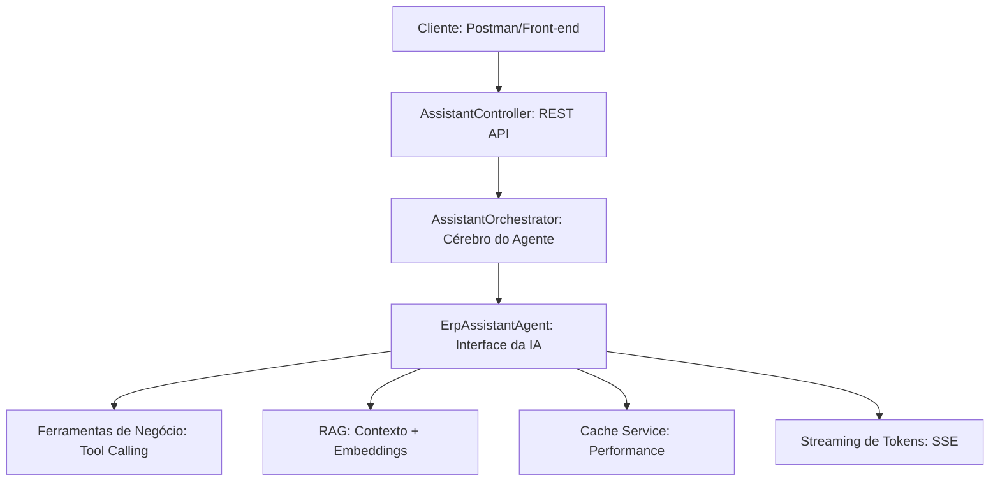

# 🤖 ERP AI Assistant — LangChain4j + Spring Boot

Este projeto apresenta um assistente inteligente de alta performance integrado ao domínio de um ERP corporativo. A solução demonstra a transição de um simples "chat com LLM" para uma **Arquitetura de Agentes** robusta, segura e contextualizada com regras de negócio.

> **Status do Projeto:** 🚀 Protótipo Funcional (Foco em IA Generativa para Negócios)

---

### 🎯 Objetivo do Projeto

O foco principal é tirar a IA do modelo genérico e trazê-la para o centro da operação. O assistente não apenas "conversa", mas entende o domínio do sistema e age como um componente ativo da arquitetura técnica.

* **Domínio Corporativo:** Respostas baseadas em regras de negócio reais (ex: Financeiro, Faturamento).
* **Segurança de Contexto:** Uso de RAG para evitar alucinações.
* **Experiência de Usuário:** Respostas fluidas via Streaming (SSE) e baixa latência com cache.

---

### 🧠 Arquitetura do Agente

A arquitetura foi desenhada para garantir separação de responsabilidades e extensibilidade:



---

### 🚀 Tecnologias Utilizadas

| Tecnologia | Função |
| --- | --- |
| **Java 17+** | Linguagem base para robustez e escalabilidade |
| **Spring Boot 3** | Backend, Injeção de Dependência e Gestão de APIs |
| **LangChain4j** | Orquestração de LLMs e Agentes de IA |
| **OpenAI API** | Modelos de linguagem (GPT-4o) e Embeddings |
| **Vector Store** | Armazenamento de vetores para busca semântica (RAG) |
| **SSE (Server-Sent Events)** | Entrega de tokens em tempo real (Streaming) |
| **Caffeine/Redis** | Cache de respostas para redução de latência e custo |

---

### 🔥 Funcionalidades Implementadas

* [x] **Agent Orchestration:** Gerenciamento de memória e fluxo de conversação.
* [x] **RAG (Retrieval Augmented Generation):** Consulta a manuais e regras do ERP antes de responder.
* [x] **Function/Tool Calling:** Capacidade da IA de decidir e executar métodos Java (ex: consultar saldo de títulos).
* [x] **Streaming UI-Ready:** Implementação de SSE para uma interface responsiva.
* [x] **Context Isolation:** IA treinada para responder apenas dentro do escopo do ERP.

---

### 📂 Estrutura do Projeto

```text
├── 📦 application
│   ├── AssistantOrchestrator.java  # Orquestra a lógica entre usuário e IA
│   ├── ErpAssistantAgent.java      # Definição do Agente e System Prompt
│   └── ErpBusinessTools.java       # "Ferramentas" que a IA pode invocar
├── 📦 config
│   ├── AssistantConfig.java        # Bean central do LangChain4j
│   ├── ChatModelConfig.java        # Configuração do LLM (Temperature, ModelId)
│   └── EmbeddingConfig.java        # Setup do RAG e Vector Database
└── 📦 web
    └── AssistantController.java    # Endpoints REST e streaming

```

---

### 📈 Diferenciais Técnicos e Visão de Valor

Este projeto demonstra competências de **Especialista em Java e IA**, focando em problemas reais de grandes sistemas:

1. **Modernização de Sistemas Legados:** Demonstra como envolver um ERP tradicional (como um sistema em Delphi ou Java legatário) com uma camada de inteligência moderna sem reescrever o core business.
2. **Redução de Custos de Suporte:** O uso de RAG permite que o assistente resolva dúvidas de usuários finais que hoje sobrecarregam o suporte técnico.
3. **Arquitetura Híbrida:** Integração entre lógica determinística (Java/Tools) e lógica probabilística (LLM), garantindo que operações críticas (como cálculos) sejam feitas pelo código Java e não pela IA.

---

### ⚙️ Como rodar o projeto

1. Clone o repositório.
2. Configure suas variáveis no `application.properties`:
```properties
openai.api.key=SUA_CHAVE_AQUI
openai.model=gpt-4o-mini

```


3. Compile e rode:
```bash
mvn clean install
mvn spring-boot:run

